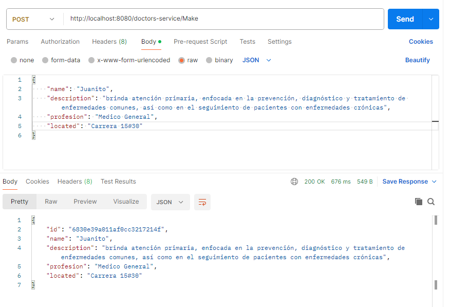
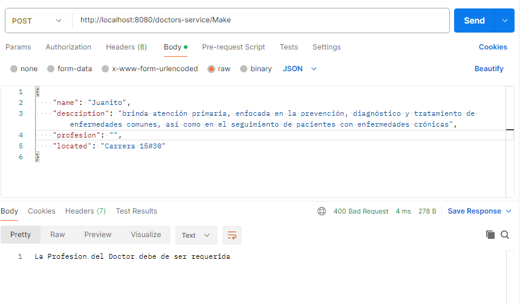
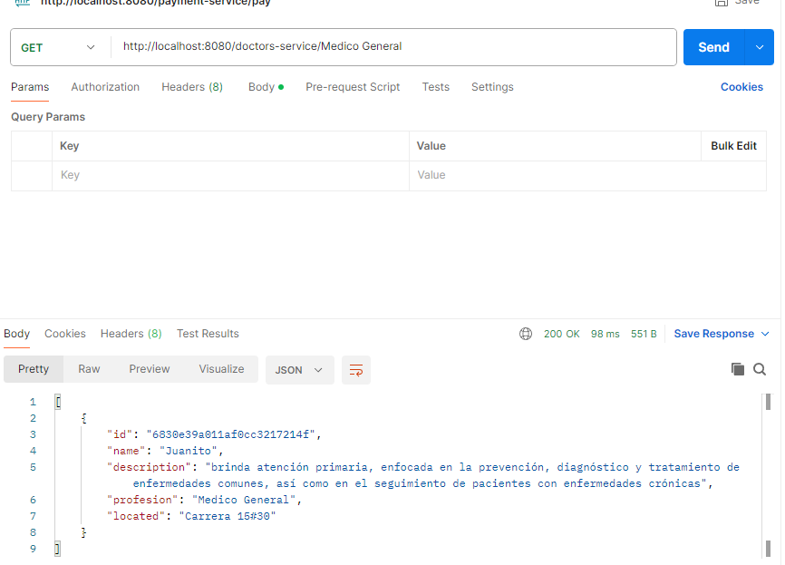
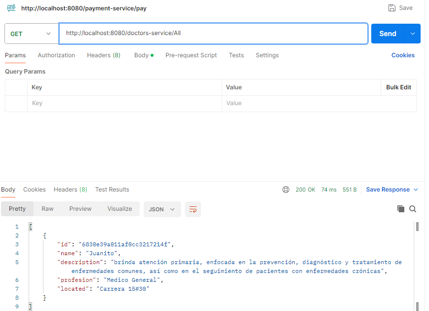
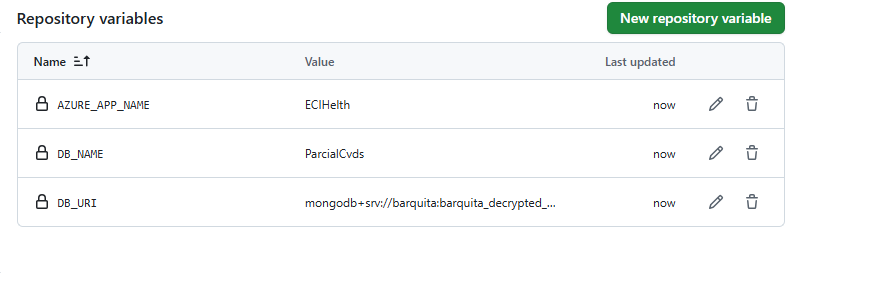
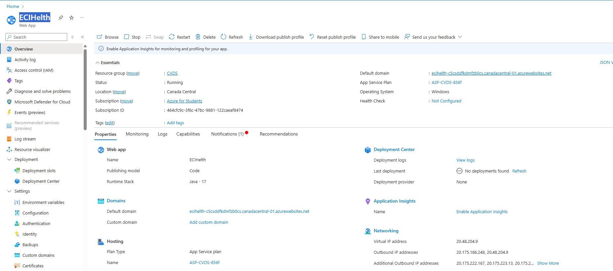
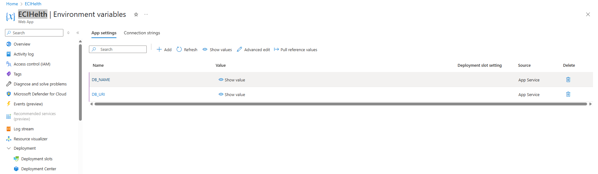

# -ECI-Salud
aplicación web simple para gestionar citas médicas

1)Se crea el proyecto

2)Se Prueba El metodo Post

3)Existen validaciones de que no pueden haber campos vacios

4)Se prueba el metodo Get por profesion

5)Se puerba el metodo Get para obtener todos

6)Seañaden las variables al gigt para el despliegue

7)Se crea la pagina en azure paar el despliegue

8)Se añaden las variables en el azure para el despieble 

